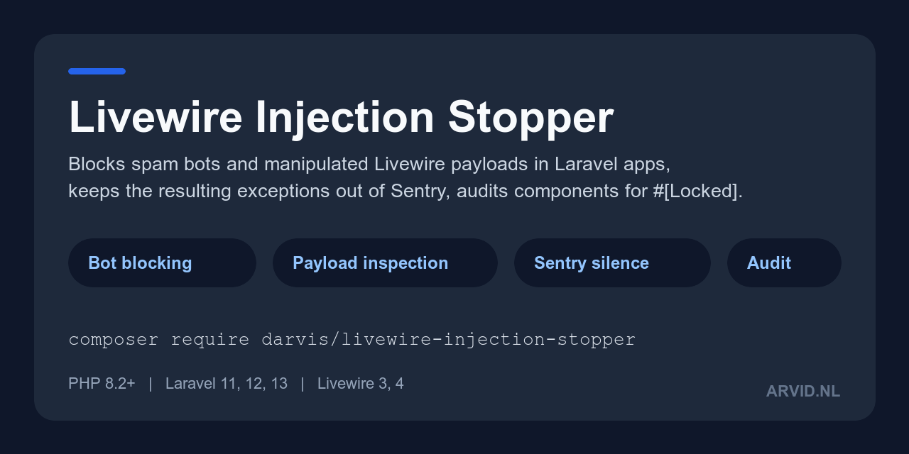

# Livewire Injection Stopper

`darvis/livewire-injection-stopper` is a Laravel package with a middleware (code that runs on a request before your route does) that rejects requests from listed User-Agents, listed IP addresses, and Livewire update requests that send an array to a property that should hold a single value. It also keeps two bot-driven Livewire exceptions out of your error tracker, and ships an artisan command that lists public Livewire properties that probably need `#[Locked]`.



## Who it is for

A Laravel application that uses [Livewire](https://livewire.laravel.com) and sees scripted traffic: log lines from `python-requests` or `curl`, or `CannotUpdateLockedPropertyException` reports in Sentry caused by replayed Livewire requests.

## What it does not do

- It does not stop a bot that sends a browser User-Agent. The User-Agent is a string the client chooses.
- It does not validate values. A request that changes `price` from `100` to `0.01` passes; only `#[Locked]` or your own validation stops that.
- It lets arrays through that are sent under a nested key such as `form.tags`, and it does not inspect anything on a whitelisted path.
- It does not cover routes outside the `web` middleware group, such as `routes/api.php`, unless you add the middleware there.
- It is not a web application firewall, a rate limiter or a CAPTCHA.

The full list is on [How it works](how-it-works.md#what-it-does-not-stop).

## Requirements

PHP 8.2+, Laravel 11, 12 or 13, and Livewire 3 or 4.

## Install

```bash
composer require darvis/livewire-injection-stopper
php artisan livewire-injection-stopper:audit
php artisan vendor:publish --tag=livewire-injection-stopper-config
```

The first line is enough: the middleware joins the `web` group when the package boots. The second line lists properties to lock. The third is optional and writes `config/livewire-injection-stopper.php`. See [Installation](installation.md) for the steps and for how to check that it works.

## Pages

- [Installation](installation.md): the steps, and two commands that prove the package is active
- [Quick start](quick-start.md): lock a property, run the audit, and count blocked requests, as one complete example
- [How it works](how-it-works.md): the four checks in order, what a block looks like, and what the package does not stop
- [Bot blocking](bot-blocking.md): User-Agents, IP addresses, whitelisted paths, the response, the log line and the event
- [Payload injection](payload-injection.md): the rules for Livewire update requests and the two silenced exceptions
- [Security audit](security-audit.md): what the audit command scans, its literal output and its limits
- [Configuration](configuration.md): every config key with its default
- [Testing](testing.md): test your own app with the package installed, without external calls
- [Troubleshooting](troubleshooting.md): a legitimate request is blocked, nothing is blocked, Sentry still reports the exception
- [FAQ](faq.md): short answers to common questions
